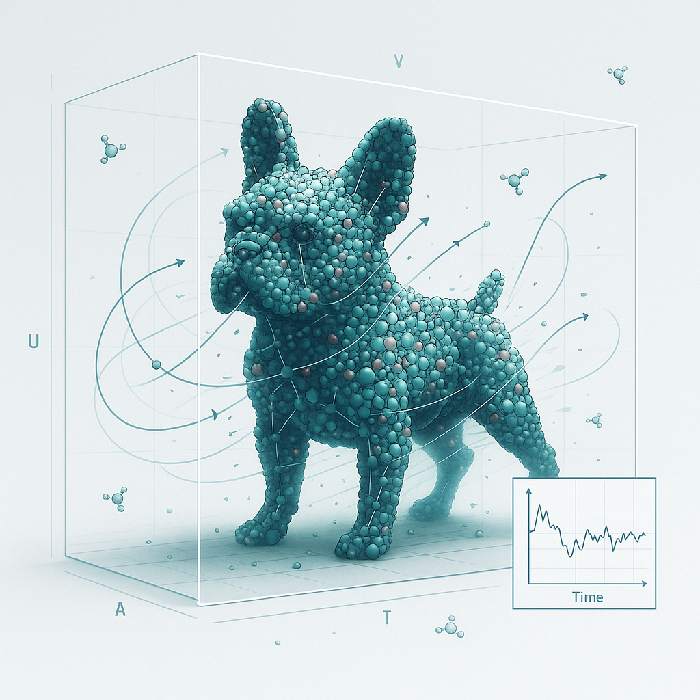

# YAGWIP: Yet Another GROMACS Wrapper In Python

[](https://www.python.org/downloads/)
[](https://www.gnu.org/licenses/gpl-3.0.en.html)
[](https://badge.fury.io/py/yagwip)

**YAGWIP** is a comprehensive Python-native application and library that automates the setup and execution of GROMACS molecular dynamics (MD) simulations, including support for both standard and Temperature Replica Exchange Molecular Dynamics (TREMD). It provides tools to generate input files, build systems, run simulations, and perform trajectory analysis, all starting from a single PDB file.

This work was inspired by the original library of Dr. Olivier Mailhot (aka Gregor Patof) and has been rewritten and optimized by Nate Levinzon (aka NDL).

---
<p align="center">
  
</p>


# YAGWIP building and simulation pipeline

## Features

### Core Functionality
- **Interactive Command Line Interface**: Full-featured CLI with tab completion and command history
- **Dynamic Debug Mode**: Toggle debug mode on/off with real-time logging adjustments
- **PDB File Processing**: Advanced PDB loading with automatic ligand detection and separation
- **GROMACS Integration**: Seamless integration with GROMACS workflows
- **Template Management**: Comprehensive template system for MDP files and SLURM scripts

### Ligand Processing Pipeline
- **Automatic Ligand Detection**: Identifies and separates ligands from protein structures
- **MOL2 Conversion**: Custom PDB-to-MOL2 converter with bond detection and atom typing
- **Quantum Chemistry Integration**: ORCA integration for charge calculation and geometry optimization
- **ACPYPE Integration**: Automated topology generation for small molecules
- **Force Field Management**: Automatic atom type assignment and force field integration

### Simulation Capabilities
- **Standard MD Workflows**: Energy minimization, NVT/NPT equilibration, production runs
- **Temperature Replica Exchange MD (TREMD)**: Advanced sampling with van der Spoel temperature predictor
- **Custom Command Override**: Flexible command customization for all GROMACS tools
- **SLURM Job Generation**: Automated SLURM script generation for HPC environments

### Trajectory Analysis
- **TREMD Analysis**: Demultiplexing, RMSD/RMSF calculation, PCA analysis
- **Temperature Analysis**: Replica temperature tracking and analysis
- **Energy Analysis**: Combined energy file processing and analysis
- **Automated Workflows**: Streamlined analysis pipelines for complex simulations

### Design Patterns & Architecture

#### Object-Oriented Design
YAGWIP implements a robust object-oriented architecture with the following design patterns:

- **Base Class Pattern**: `YagwipBase` provides common functionality for all components
- **Mixin Pattern**: `LoggingMixin` provides consistent logging across all classes
- **Factory Pattern**: Template-based generation of SLURM scripts and MDP files
- **Strategy Pattern**: Configurable command execution with custom overrides

#### Component Architecture
```
YagwipShell (CLI)
├── Builder (System Building)
├── Modeller (Structure Modeling)
├── LigandPipeline (Ligand Processing)
├── Sim (Simulation Execution)
├── SlurmWriter (Job Script Generation)
└── Editor (File Manipulation)
```

#### Logging System
- **Hierarchical Logging**: Structured logging with configurable levels
- **File and Console Output**: Dual logging to files and console
- **Timestamped Logs**: Automatic log file generation with timestamps
- **Debug Mode**: Real-time debug mode toggling

#### Error Handling
- **Graceful Degradation**: Robust error handling with informative messages
- **Validation System**: Comprehensive input validation and file checking
- **Recovery Mechanisms**: Automatic recovery from common errors

## Installation

### Prerequisites
- Python 3.6 or higher
- GROMACS installation
- Optional: ORCA (for quantum chemistry calculations)
- Optional: ACPYPE (for ligand parameterization)

### Installation Methods

#### From GitHub
```bash
pip install git+https://github.com/ndlevinzon/yagwip_package.git
```

#### From Local Repository
```bash
git clone https://github.com/ndlevinzon/yagwip_package.git
cd yagwip_package
pip install -e .
```

#### From PyPI
```bash
pip install yagwip
```

## Usage

### Interactive Mode
Launch the interactive command-line interface:
```bash
yagwip
# or
yagwip -i
```

### Batch Mode
Run YAGWIP with an input script for high-throughput processing:
```bash
yagwip -f files.in
```

### Command Reference

#### System Setup Commands
```bash
loadpdb protein.pdb                    # Load PDB file
loadpdb ligand.pdb --ligand_builder    # Load with ligand processing
pdb2gmx                                # Generate topology
solvate                                # Add solvent
genions                                 # Add ions
```

#### Simulation Commands
```bash
em                                     # Energy minimization
nvt                                    # NVT equilibration
npt                                    # NPT equilibration
production                             # Production MD
tremd calc complex.solv.ions.gro      # Calculate TREMD temperature ladder
```

#### Analysis Commands
```bash
slurm md cpu                          # Generate MD SLURM script
slurm tremd gpu                       # Generate TREMD SLURM script
source custom.itp                     # Include custom topology
```

### Advanced Features

#### Ligand Processing Pipeline
The ligand processing pipeline automatically:
1. **Detects ligands** in PDB files (HETATM entries)
2. **Separates protein and ligand** into distinct files
3. **Converts PDB to MOL2** with bond detection and atom typing
4. **Runs quantum chemistry** calculations (if ORCA is available)
5. **Generates GROMACS topologies** using ACPYPE
6. **Integrates with force fields** automatically

```bash
# Load PDB with automatic ligand processing
loadpdb complex.pdb --ligand_builder --c 0 --m 1
```

#### TREMD Temperature Ladder Generation
YAGWIP implements the van der Spoel temperature predictor for optimal TREMD setup:

```bash
# Calculate temperature ladder for TREMD
tremd calc complex.solv.ions.gro
# Enter: Initial Temperature (K): 300
# Enter: Final Temperature (K): 400  
# Enter: Exchange Probability (0 < P < 1): 0.2
```

#### Custom Command Override
Override default GROMACS commands for specialized workflows:

```bash
set pdb2gmx    # Customize pdb2gmx command
set solvate    # Customize solvate command
set genions    # Customize genions command
```

#### SLURM Script Generation
Generate customized SLURM scripts for HPC environments:

```bash
# Generate MD scripts
slurm md cpu   # CPU-based MD
slurm md gpu   # GPU-based MD

# Generate TREMD scripts
slurm tremd cpu   # CPU-based TREMD
slurm tremd gpu   # GPU-based TREMD
```

## Configuration

### Environment Variables
- `GMX_PATH`: Path to GROMACS executable (default: "gmx")
- `ORCA_PATH`: Path to ORCA executable (optional)
- `ACPYPE_PATH`: Path to ACPYPE executable (optional)

### Template System
YAGWIP uses a comprehensive template system located in `src/yagwip/templates/`:

- **MDP Files**: Energy minimization, NVT/NPT, production, TREMD templates
- **SLURM Scripts**: CPU/GPU templates for MD and TREMD
- **Force Fields**: Amber14SB force field files
- **Banners**: ASCII art and quotes for CLI

### Runtime Monitoring & Logging
YAGWIP includes comprehensive runtime monitoring and logging:

#### Runtime Monitoring
- **Execution Time**: Tracks duration of each operation
- **Memory Usage**: Monitors memory consumption and changes
- **CPU Usage**: Tracks CPU utilization during operations
- **System Information**: Captures platform, Python version, process ID
- **Performance Metrics**: Calculates success rates and averages

#### Logging Features
- **Debug Mode**: Toggle with `debug` command
- **Log Files**: Automatically generated with timestamps and detailed formatting
- **Log Levels**: DEBUG, INFO, WARNING, ERROR, SUCCESS, RUNTIME
- **System Snapshots**: Captures system state at operation start/end
- **Performance Summary**: Provides runtime statistics and metrics

#### Runtime Commands
```bash
runtime                    # Show runtime statistics and performance metrics
```

#### Log File Format
Enhanced log files include:
- Timestamp with date and time
- Line numbers for debugging
- System information at startup
- Runtime metrics for each operation
- Memory and CPU usage tracking
- Success/failure status with error messages

## Analysis Tools

### YAGTRAJ - Trajectory Analysis
YAGWIP includes a dedicated trajectory analysis tool:

```bash
yagtraj    # Launch trajectory analysis shell
```

#### TREMD Analysis Commands
```bash
tremd demux [base_name]    # Demultiplex TREMD trajectories
tremd rmsd [base_name]     # Calculate RMSD for all replicas
tremd rmsf [base_name]     # Calculate RMSF for all replicas
tremd pca [base_name]      # Perform PCA analysis
tremd temp [base_name]     # Extract temperature data
tremd energy [base_name]   # Combine energy files
```

### Standard Analysis Commands
```bash
rmsd                    # Calculate RMSD
rmsf                    # Calculate RMSF
pca                     # Principal Component Analysis
gyrate                  # Radius of gyration
hbond                   # Hydrogen bond analysis
```

## Architecture Details

### Core Classes

#### YagwipBase
The foundation class providing common functionality:
- **Logging**: Standardized logging methods
- **Configuration**: Centralized configuration management
- **File Operations**: Safe file operations with validation
- **Command Execution**: Standardized command execution

#### Builder
Handles GROMACS system building:
- **pdb2gmx**: Topology generation
- **solvate**: Solvent addition
- **genions**: Ion addition

#### LigandPipeline
Advanced ligand processing:
- **PDB-to-MOL2**: Custom converter with bond detection
- **Quantum Chemistry**: ORCA integration
- **Topology Generation**: ACPYPE integration
- **Force Field Integration**: Automatic atom type assignment

#### Sim
Simulation execution and management:
- **Standard MD**: Energy minimization, equilibration, production
- **TREMD**: Temperature replica exchange setup
- **Template Management**: MDP file handling

#### SlurmWriter
HPC job script generation:
- **Template Processing**: Customized SLURM script generation
- **Hardware Optimization**: CPU/GPU specific configurations
- **Workflow Integration**: Seamless integration with simulation workflows

### Design Patterns Implementation

#### Mixin Pattern
```python
class LoggingMixin:
    def _log(self, msg):
        """Consistent logging across all components"""
        logger = getattr(self, "logger", None)
        if logger:
            logger.info(msg)
        else:
            print(msg)
```

#### Template Method Pattern
```python
class YagwipBase(LoggingMixin, ABC):
    def _execute_command(self, command, description, **kwargs):
        """Template method for command execution"""
        # Common setup
        # Execute command
        # Common cleanup
```

#### Strategy Pattern
```python
class Builder(YagwipBase):
    def run_pdb2gmx(self, basename, custom_command=None):
        """Configurable command execution"""
        command = custom_command or self._default_pdb2gmx_command()
        return self._execute_command(command, "pdb2gmx")
```

## Examples

### Basic Protein MD Workflow
```bash
yagwip
loadpdb protein.pdb
pdb2gmx
solvate
genions
em
nvt
npt
production
```

### Ligand-Protein Complex Workflow
```bash
yagwip
loadpdb complex.pdb --ligand_builder --c 0 --m 1
pdb2gmx
solvate
genions
em
nvt
npt
production
```

### TREMD Workflow
```bash
yagwip
loadpdb protein.pdb
pdb2gmx
solvate
genions
tremd calc complex.solv.ions.gro
slurm tremd cpu
# Submit generated SLURM script
```

### Analysis Workflow
```bash
yagtraj
tremd demux remd
tremd rmsd remd
tremd pca remd
```

## Contributing

We welcome contributions! Please see our contributing guidelines:

1. **Fork the repository**
2. **Create a feature branch**: `git checkout -b feature/amazing-feature`
3. **Commit your changes**: `git commit -m 'Add amazing feature'`
4. **Push to the branch**: `git push origin feature/amazing-feature`
5. **Open a Pull Request**

### Development Setup
```bash
git clone https://github.com/ndlevinzon/yagwip_package.git
cd yagwip_package
pip install -e .
pytest  # Run tests
```

## License

This project is licensed under the GNU General Public License v3.0 only - see the [LICENSE](LICENSE) file for details.

## Acknowledgments

- **Dr. Olivier Mailhot (Gregor Patof)**: Original inspiration and foundation
- **David van der Spoel**: TREMD temperature predictor algorithm
- **GROMACS Development Team**: Molecular dynamics engine
- **ORCA Development Team**: Quantum chemistry calculations
- **ACPYPE Development Team**: Ligand parameterization

## Citation

If you use YAGWIP in your research, please cite:

```bibtex
@software{yagwip2024,
  title={YAGWIP: Yet Another GROMACS Wrapper In Python},
  author={Levinzon, Nate and Mailhot, Olivier},
  year={2025},
  url={https://github.com/ndlevinzon/yagwip_package}
}
```

## Support

- **Issues**: [GitHub Issues](https://github.com/ndlevinzon/yagwip_package/issues)
- **Documentation**: [GitHub Wiki](https://github.com/ndlevinzon/yagwip_package/wiki)
- **Email**: [Contact the maintainers](mailto:maintainers@yagwip.org)

---

**YAGWIP** - Making GROMACS workflows simple, powerful, and reproducible.
