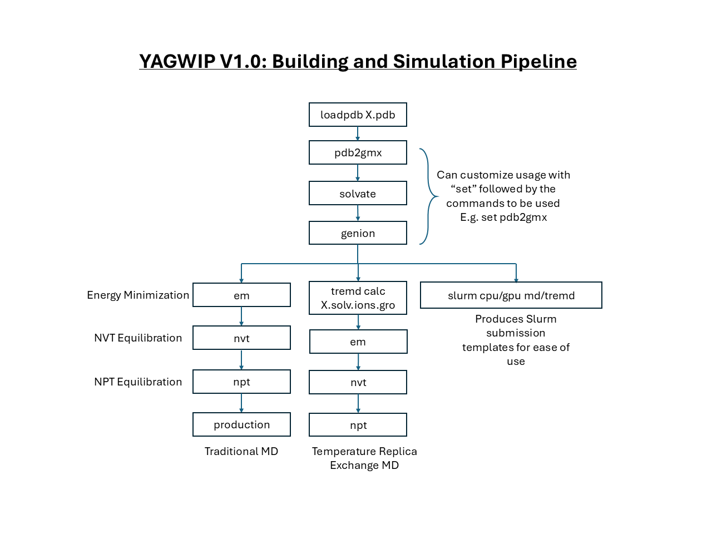

# YAGWIP: Yet Another GROMACS Wrapper In Python

YAGWIP is a Python-native application and library that automates the setup and execution of GROMACS molecular dynamics (MD) simulations, including support for both standard and Temperature Replica Exchange Molecular Dynamics (TREMD). It provides tools to generate input files, build systems, run simulations, and perform trajectory analysis, all starting from a single PDB.
This work was inspired by the original library of Dr. Olivier Mailhot (aka Gregor Patof), and has been rewritten and optimized by Nate Levinzon (aka NDL).

---


 
## Features
- Interactive command line interface.
- Dynamic debug mode with toggling and on/off options.
- PDB file loading with tab completion.
- Simplified execution of GROMACS commands with optional user customization.
- Generation of SLURM submission files.

## Installation
In your Python environment, simply run:
```python
pip install git+https://github.com/ndlevinzon/yagwip_package.git
```

## Usage
Once installed, YAGWIP can be run either interactively or via input file for easy high-throughput functionality:
```python
yagwip or yagwip -i # launches CLI
yagwip -f files.in  # launches input script
```
# YAGWIP Authors
## Contributors
# External Code
